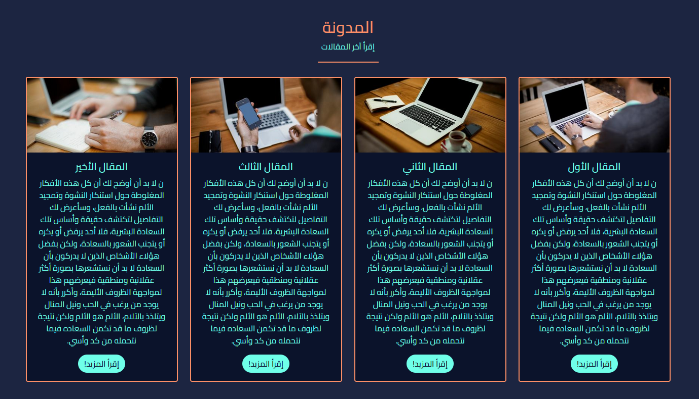

# personio

<header id="header" class="sticky-top">

<nav class="primary-menu navbar navbar-dark">

الإصدار 1.0 

</nav>

</header>

### - [Demo](https://prrsonio.amers.app)
### - [رابط التوثيق](https://prrsonio-doc.amers.app)

*   [البدء](#idocs_start)
    *   [التثبيت](#idocs_installation)
    *   [بنية القالب](#idocs_html_structure)
*   [تخطيط القالب](#idocs_layout)
    *   [إعدادات الشعار](#idocs_logo_settings)
    *   [الشريط العلوي](#idocs_navbar)
    *   [القسم العلوي](#idocs_landing)
    *   [قسم الخدمات](#idocs_service)
    *   [قسم تواصل معي](#idocs_contactMe)
    *   [المدونة](#idocs_blog)
    *   [اخر المشاريع](#idocs_lastProj)
    *   [مهاراتي](#idocs_mySkills)
    *   [شركاء النجاح](#idocs_partners)
    *   [اراء العملاء](#idocs_comments)
    *   [نموذج الإتصال](#idocs_contactForm)
    *   [التذييل](#idocs_footer)
*   [التراخيص والاعتمادات](#idocs_source_credits)
    *   [الصور](#idocs_fotos)
    *   [الخطوط والايقونات](#idocs_fonts)
    *   [شفرات جافاسكربت](#idocs_js)

<section id="idocs_start">

# دليل المستخدم

## قالب بيرسونيو الشخصي

شكرا جزيلا لشرائك قالب بريسونيو عبر بيكاليكا

* * *

*   **الإصدار:** 1.0
*   **الكاتب:** [عامر مالك محمد](https://www.amer.website)

*   **تاريخ الإصدار:** 16 مارس 2022
*   **آخر تحديث:** 16 مارس 2022

إذا كانت لديك أي أسئلة خارج نطاق ملف المساعدة هذا ، فلا تتردد في إرسال بريد إلكتروني عبر [صفحة الدعم الفني](https://picalica.com/u/ameralrawi).

</section>

* * *

<section id="idocs_installation">

## التثبيت

قالب بيرسونيو قالب HTML ثابت "ستاتيكي" بعد تعديله حسب إحتياجك يمكنك رفعه على أي استضافة بشكل مباشر ومن ثم طلب المسار الذي يتواجد عليه ملف index.html

### خطوات تثبيت القالب

1.  قم بفك الضغط عن الملف المضغوط **personio.zip**
2.  بعد فك الضغط سيظهر لنا مجلد personio والذي يحتوي على الملفين index.html و index_ar.html والمجلد assets
    *   `personio/assets` - يحتوي على المجلدات التالية :
        *   `personio/css` -مجلد ملفات التنسيقات
        *   `personio/imgs` - مجلد الصور
        *   `personio/js` - مجلد ملفات جافاسكربت
        *   `personio/webfonts` – مجلد الخطوط
    *   `personio/index.html` - النسخة الإنجليزية
    *   `personio/index_ar.html` - النسخة العربية
3.  يجب رفع ملفات جميع الملفات إلى الإستضافة

</section>

* * *

<section id="idocs_html_structure">

## بنية القالب

يتبع Personio بنية تشفير بسيطة وسهلة التخصيص. هذه هي هيكلية القالب يمكنك الرجوع اليها دوما:  
القالب مبني على اخر اصدار من اطار عمل [بوتستراب](https://getbootstrap.com/)

                           <!DOCTYPE html>
    <html lang="en">
    <head>

    <!--  عنوان الموقع، الوصف، صفحات التنسيقات والخطوط
    ============================================= -->

    </head>

    <body>

    <!-- القائمة الرئيسية
    =============================== -->
    <nav id="navBar">
    </nav>
    <!-- نهاية القائمة الرئيسية
    =============================== -->
    <!-- القسم الرئيسي
    =============================== -->
    <section id="landing">
    </section>
    <!-- نهاية القسم الرئيسي
    =============================== -->
    <!-- قسم الخدمات
    =============================== -->
    <section id="features">
    </section>
    <!-- نهاية قسم الخدمات
    =============================== -->
    <!-- قسم طرق التواصل
    =============================== -->
    <section id="service">
    </section>
    <!-- نهاية قسم طرق التواصل
    =============================== -->
    <!-- المدونة
    =============================== -->
    <section id="blog">
    </section>
    <!-- نهاية المدونة
    =============================== -->
    <!-- قسم ملف الأعمال
    =============================== -->
    <section id="Portfolio">
    </section>
    <!-- نهاية قسم ملف الاعمال
    =============================== -->
    <!-- قسم المهارات
    =============================== -->
    <section class="my-skills">
    </section>
    <!-- نهاية قسم المهارات
    =============================== -->
    <!-- قسم شعارات الشركاء
    =============================== -->
    <section class="client-section text-center pb-5">
    </section>
    <!-- نهاية قسم شعارات الشركاء
    =============================== -->
    <!-- القسم آراء العملاء
    =============================== -->
    <section class="customers-section">
    </section>
    <!-- نهاية قسم آراء العملاء
    =============================== -->
    <!-- قسم نموذج الإتصال
    =============================== -->
    <section id="Contact">
    </section>
    <!-- نهاية قسم نموذج الإتصال
    =============================== -->
    <!-- التذييل / الفوتر -->
    <footer>
    </footer>
    <!-- نهاية التذييل -->

    <!-- ملفات جافاسكربت -->
    </body>
    </html>

إذا كنت بحاجة إلى مزيد من المعلومات ، فيرجى زيارة موقع [bootstrap](https://getbootstrap.com/docs/4.4/layout/grid/)

</section>

* * *

<section id="idocs_logo_settings">

## إعدادات الشعار

يمكن إيجاد حاوية الشعار ضمن العنصر`<nav>`

                <!--logo start-->
                
                
                شعاري
                <!--logo end-->

كما تلاحظ هناك شعارين احدهما غامق والآخر فاتح، يتم إستيراد الشعارات من مجلد imgs. إضافة إلى الشعارات فإن هناك عنصر span يحتوي على العبارة اسفل الشعار.

</section>

* * *

<section id="idocs_navbar">

## الشريط العلوي الأساسي

للتعديل على محتوى الشريط العلوي يمكن إيجاد الشريط العلوي ضمن العنصر nav ايضا

                <ul class="navbar-nav ms-auto mb-2 mb-lg-0">
                    <li class="nav-item ">
                        <a class="nav-link p-lg-3 p-2 active" aria-current="page" href="#landing">الرئيسية</a>
                    </li>
                    <li class="nav-item">
                        <a class="nav-link p-lg-3 p-2" href="#features">مميزات</a>
                    </li>
                    <li class="nav-item">
                        <a class="nav-link p-lg-3 p-2" href="#service">خدماتي</a>
                    </li>
                    <li class="nav-item">
                        <a class="nav-link p-lg-3 p-2" href="#blog">المدونة</a>
                    </li>
                    <li class="nav-item">
                        <a class="nav-link p-lg-3 p-2" href="#Portfolio">المعرض</a>
                    </li>
                    <li class="nav-item">
                        <a class="nav-link p-lg-3 p-2" href="#skills">عنّي</a>
                    </li>
                    <li class="nav-item">
                        <a class="nav-link p-lg-3 p-2" href="#Contact">إتصل بي</a>
                    </li>
                </ul>

</section>

* * *

<section id="idocs_landing">

## القسم العلوي الأساسي

للتعديل على محتوى القسم العلوي الأساسي قم بتغيير المحتوى ضمن القسم التالي

    <section id="landing" class="landing d-flex justify-content-center align-items-center">
        

            <h1 class="fw-bold">مرحبًا ، أنا موظفك القادم</h1>
            
اسمي جون ديو ، وأنا مصمم متعدد التخصصات ، أركز على
                تقاطعات البساطة والفضاء السلبي في العالم الرقمي.

            <a class="btn btn-primary custom-btn rounded-pill fs-3" href="#">وظفني!</a>
        

    </section>

لتغيير صورة الخلفية يجب الذهاب إلى ملف personio.css المتواجد ضمن المسار التالي`personio/css`

ثم قم بتعديل مسار الصورة ضمن background-image

    .landing::before {
        ....
        background-image: url("../imgs/portrait.svg");
        ....
    }

</section>

* * *

<section id="idocs_service">

## قسم الخدمات

للتعديل على محتوى قسم الخدمات قم بتغيير المحتوى ضمن القسم التالي

    <section id="features" class="features text-center">
        

            

                <h2 class="mt-5 text-uppercase">أنا اقدّم لك</h2>
                
الخدمات التالية

            

              ..........
                

                    

                        

                            <i class="fa-solid fa-6 position-absolute bottom-0 service-count"></i>
                            <i class="fa-solid fa-chess-bishop fa-4x position-absolute bottom-0 service-icon"></i>
                        

                        <h4 class="my-3 text-uppercase">تخطيط</h4>
                        
 لا بد أن أوضح لك أن كل هذه الأفكار المغلوطة حول استنكار  النشوة وتمجيد الألم نشأت بالفعل، وسأعرض لك التفاصيل لتكتشف حقيقة وأساس تلك السعادة البشرية، فلا أحد يرفض أو يكره أو يتجنب الشعور بالسعادة، ولكن بفضل هؤلاء الأشخاص الذين لا يدركون بأن السعادة لا بد أن نستشعرها بصورة أكثر عقلانية ومنطقية فيعرضهم هذا لمواجهة الظروف الأليمة، وأكرر بأنه لا يوجد من يرغب في الحب ونيل المنال ويتلذذ بالآلام، الألم هو الألم ولكن نتيجة لظروف ما قد تكمن السعاده فيما نتحمله من كد وأسي.

                    

                

             ..........
            

        

    </section>

</section>

* * *

<section id="idocs_contactMe">

## قسم تواصل معي

للتعديل على محتوى قسم تواصل معي قم بتغيير المحتوى ضمن القسم التالي

    <section id="service" class="contact-options-section text-center py-5">
        

            

                <h2 class="mt-5 text-uppercase">تواصل معي</h2>
                
أنا متاح على المنصات التالية

            

            

                .......
                

                    
                    .......
                

                .......
                

                    <h2 class="mt-5 text-uppercase fs-4">خيارات الاتصال الأخرى</h2>
                    <a href="mailto:info@example.com" id="contact-icon"
                       class="btn btn-primary custom-btn rounded-pill text-uppercase fs-3 me-0 me-md-2 mb-1 mb-sm-0">بريد الكتروني</a>
                    <a href="" id="Whatsapp" class="btn btn-primary whatsapp-btn rounded-pill text-uppercase fs-3">واتساب</a>
                

            

        

    </section>

لإضافة رقم واتساب الخاص بك يجب التوجه إلى ملف main.js الموجود ضمن المسار التالي `personio/js`

ثم تعديل الكود التالي حيث يتم تبديل الأصفار برقم واتساب بالإضافة إلى مفتاح الدولة:

    $('#Whatsapp').attr('href', 'https://api.whatsapp.com/send?phone=0000000000&amp;text=Hi, I got this phone number from you website');

</section>

* * *

<section id="idocs_blog">

## قسم المدونة

للتعديل على محتوى قسم المدونة قم بتغيير المحتوى ضمن القسم التالي

    <section id="blog" class="blog text-center mb-5">
        

            <h2 class="mt-5 text-uppercase">المدونة</h2>
            
إقرأ آخر المقالات

        

        

            

                .....
                

                    

                        
                        

                            <h5 class="card-title">المقال الثاني</h5>
                            
ن لا بد أن أوضح لك أن كل هذه الأفكار المغلوطة حول استنكار  النشوة وتمجيد الألم نشأت بالفعل، وسأعرض لك التفاصيل لتكتشف حقيقة وأساس تلك السعادة البشرية، فلا أحد يرفض أو يكره أو يتجنب الشعور بالسعادة، ولكن بفضل هؤلاء الأشخاص الذين لا يدركون بأن السعادة لا بد أن نستشعرها بصورة أكثر عقلانية ومنطقية فيعرضهم هذا لمواجهة الظروف الأليمة، وأكرر بأنه لا يوجد من يرغب في الحب ونيل المنال ويتلذذ بالآلام، الألم هو الألم ولكن نتيجة لظروف ما قد تكمن السعاده فيما نتحمله من كد وأسي.

                            <button type="button" class="btn btn-primary custom-btn rounded-pill text-uppercase" data-bs-toggle="modal" data-bs-target="#blog2" >إقرأ المزيد!</button>
                            <!-- Modal -->
                            

                                

                                    

                                        

                                            <button type="button" class="btn-close" data-bs-dismiss="modal" aria-label="Close"></button>
                                            
                                            <h5 class="modal-title" id="postTitle2">المقال الثاني</h5>
                                        

                                        

                                            ن لا بد أن أوضح لك أن كل هذه الأفكار المغلوطة حول استنكار  النشوة وتمجيد الألم نشأت بالفعل، وسأعرض لك التفاصيل لتكتشف حقيقة وأساس تلك السعادة البشرية، فلا أحد يرفض أو يكره أو يتجنب الشعور بالسعادة، ولكن بفضل هؤلاء الأشخاص الذين لا يدركون بأن السعادة لا بد أن نستشعرها بصورة أكثر عقلانية ومنطقية فيعرضهم هذا لمواجهة الظروف الأليمة، وأكرر بأنه لا يوجد من يرغب في الحب ونيل المنال ويتلذذ بالآلام، الألم هو الألم ولكن نتيجة لظروف ما قد تكمن السعاده فيما نتحمله من كد وأسي.
                                        

                                        

                                            <button type="button" class="btn btn-secondary custom-btn rounded-pill text-uppercase" data-bs-dismiss="modal">إغلاق</button>
                                        

                                    

                                

                            

                        

                    

                

               .....
            

        

    </section>

</section>

* * *

<section id="idocs_lastProj">

## قسم آخر المشاريع

للتعديل على محتوى قسم آخر المشاريع قم بتغيير المحتوى ضمن القسم التالي

    <section id="Portfolio" class="portfolio text-center py-5">
        

            

                <h2 class="mt-5 text-uppercase">آخر المشاريع</h2>
                
تحقق من مشاريعي الأخيرة!

            

            <ul class="list-unstyled work-type-list d-flex justify-content-center my-5">
                <li class="active">الكل</li>
                <li>تصميم</li>
                <li>تطوير</li>
                <li>تصوير</li>
                <li>تطبيقات</li>
            </ul>
            

                ........
                

                    

                        
                    

                

                

                    

                        
                    

                

                

                    

                        
                    

                

                

                    

                        
                    

                

                ........
            

            

                <button id="loadMore" class="btn btn-primary custom-btn rounded-pill text-uppercase d-flex  fs-3"
                        onclick="loadMore();">إعرض المزيد
                </button>
                <button id="loadLess" class="btn btn-primary custom-btn rounded-pill text-uppercase d-none  fs-3"
                        onclick="loadLess()">إعرض أقل
                </button>
            

        

    </section>

</section>

* * *

<section id="idocs_mySkills">

## قسم مهاراتي

للتعديل على محتوى قسم مهاراتي قم بتغيير المحتوى ضمن القسم التالي، قم بتغيير مستوى المهارة من خلال تغيير قيمة data-value

    <section class="my-skills text-center">
        

            

                <h2 class="mt-5 text-uppercase">مهاراتي</h2>
                
لكن لا بد أن أوضح لك أن كل هذه الأفكار المغلوطة حول استنكار

            

            

                
                

                    

                

                

                    

                

                .....
            

        

    </section>

لتغيير اسماء المهارات يجب التعديل على ملف main.js الموجود ضمن المسار التالي`personio/js`

ثم تعديل الكود التالي حيث يتم اضافة المهارات ضمن مصفوفة المهارات

    let skillList = ['Html', 'Css', 'js', 'Saas', 'NodeJS', 'PHP'];

</section>

* * *

<section id="idocs_partners">

## قسم شركاء النجاح

للتعديل على محتوى قسم شركاء النجاح قم بتغيير المحتوى ضمن القسم التالي

**ملاحظة مهمة: لكي يعمل شريط العرض بشكل صحيح يجب ان يتم إضافة الشعارات مرتين، على سبيل المثال: عندما يكون لدينا 5 شعارات يتم اضافتهم ومن ثم نسخهم ولصقهم مباشرة فيكون العدد 10 شعارات.**

    <section class="client-section text-center pb-5" dir="ltr">
        

            

                <h2 class="py-5 text-uppercase">شركاء النجاح</h2>
            

            

                

                    

                            .....
                        

                            
                        

                        

                            
                        

                            .....
                    

                

            

        

    </section>

لكي يعمل الشريط بالشكل المطلوب يجب التعديل على ملف personio.css الموجود ضمن مجلد`personio/css`

    .slides-main-container .slides-holder {
        -webkit-animation: sliding 30s linear infinite;
        animation: sliding 30s linear infinite;
        display: -webkit-box;
        display: flex;
        align-items: center;
        justify-content: space-between;
        /*يجب أن يكون العرض مساويًا لناتج ضرب 250 بكمية العناصر. هنا لدينا 32 عنصر */
        width: calc(250px * 32);
    }
    ....
    ....
    ....
    @-webkit-keyframes sliding {
        0% {
            -webkit-transform: translateX(0);
            transform: translateX(0);
        }
        100% {
            /*قيمة transform يجب ان تكون ناتج ضرب 250 بنصف العدد الكلي للعناصر (الشعارات) نصف 32 = 16*/
            /*transform must be the product of 250 with half of items amount*/
            -webkit-transform: translateX(calc(-250px * 16));
            transform: translateX(calc(-250px * 16));
        }
    }

    @keyframes sliding {
        0% {
            -webkit-transform: translateX(0);
            transform: translateX(0);
        }
        100% {
            /*قيمة transform يجب ان تكون ناتج ضرب 250 بنصف العدد الكلي للعناصر (الشعارات) نصف 32 = 16*/
            /*transform must be the product of 250 with half of items amount*/
            -webkit-transform: translateX(calc(-250px * 16));
            transform: translateX(calc(-250px * 16));
        }
    }

</section>

* * *

<section id="idocs_comments">

## قسم آراء عملائي

للتعديل على محتوى قسم آراء عملائي قم بتغيير المحتوى ضمن القسم التالي

    <section class="customers-section">
        

            

                <h2 class="mt-5 text-uppercase">آراء عملائي</h2>
                
ماذا يقول عملائي

            

            

                

                    

                        <!-- Wrapper for slides -->
                        

                            

                                

                                    

                                        <i class="fa fa-quote-left" aria-hidden="true"></i>
                                        
يتم عرض المراجعة هنا ... يتم عرض المراجعة هنا ... يتم إجراء المراجعة
                                            هنا ... يتم عرض المراجعة هنا ...

                                        <i class="fa fa-quote-right" aria-hidden="true"></i> 
                                    

                                    

                                        

                                            
                                        

                                        

                                            

                                            <h4><strong>إسم العميل</strong></h4>
                                            
وظيفة العميل 
                                                المشروع المنجز
                                            

                                        

                                    

                        .....
    </section>

</section>

* * *

<section id="idocs_contactForm">

## قسم إتصل بي

للتعديل على محتوى قسم إتصل بي قم بتغيير المحتوى ضمن القسم التالي

    <section id="Contact" class="contact-info-section py-5">
        

            <h2 class="main-title py-5 position-relative text-center fs-2 text-uppercase">إتصل بي</h2>
            

                

                    <h4 class="heading-with-border-bottom">معلومات الإتصال</h4>
                    

                        

                           <i class="fas fa-phone fa-lg"></i>
                            +00 000 0000 0000
                        

                        

                             <i class="fas fa-envelope fa-lg"></i>
                            example@example.com
                        

                        

                            <i class="fas fa-map-marker-alt fa-lg"></i>
                            العنوان: طريق الملك فهد، السعودية
                        

                    

                

                

                    <h4>إترك رسالة</h4>
                    <form class="row light-row" action="https://formspree.io/f/xwkavlqg" method="POST">
                        

                            <input class="form-control m-1" name="name" placeholder="الإسم" required="">
                        

                        

                            <input class="form-control m-1" name="_replyto" type="email" placeholder="البريد الإلكتروني" required="">
                        

                        

                            <textarea class="form-control m-1" name="message"
                                placeholder="محتوى الرسالة" required=""></textarea>
                        

                        

                            <button type="submit" class="btn btn-primary custom-btn text-uppercase">أرسال</button>
                        

                    </form>
                

            

        

    </section>

**ملاحظة مهمة جدا: لكي تصلك رسائل المستخدمين من خلال نموذج الإتصال، يجب التسجيل في موقع https://formspree.io حيث سوف تحصل بعد التسجيل على رابط خاص بك قم بنسخ الرابط الخاص بك واستبدله في الرابط الموجود ضمن action في الفورم اعلاه.**</section>

* * *

<section id="idocs_footer">

## قسم التذييل

للتعديل على محتوى التذييل قم بتغيير المحتوى ضمن القسم التالي

    <footer>
        

            

                

                    

                        <a href="https://picalica.com" class="text-uppercase">إحصل على بيرسونيو</a>
                    

                    

                        This is my code
                    

                    

                        <a href="https://www.facebook.com/ameralrawi">
                            <i class="fab fa-facebook-square fa-lg"></i>
                        </a>
                        <a href="https://www.twitter.com/ameralrawi">
                            <i class="fab fa-twitter-square fa-lg"></i>
                        </a>
                        <a href="https://www.instagram.com/ameralrawi">
                            <i class="fab fa-instagram fa-lg"></i>
                        </a>
                    

                

            

        

    </footer>

</section>

<section id="idocs_source_credits">

## التراخيص والإعتمادات

#### الصور:

*   Freepik - [freepik.com](https://freepik.com/)
*   Lorem Picsum - [https://picsum.photos](https://picsum.photos/)

#### الخطوط:

*   Icons Font Face - [https://fontawesome.com](https://fontawesome.com/)
*   Cairo - Google fonts - [https://fonts.google.com](https://fonts.google.com/)

#### شفرات جافاسكربت:

*   jQuery - [http://www.jquery.com/](http://www.jquery.com/)
*   Bootstrap 5 - [http://getbootstrap.com/](http://getbootstrap.com/)
*   AOS - [https://michalsnik.github.io](https://michalsnik.github.io)
*   Progress bar - [https://kimmobrunfeldt.github.io](https://michalsnik.github.io)

</section>

 "Back to Top")

